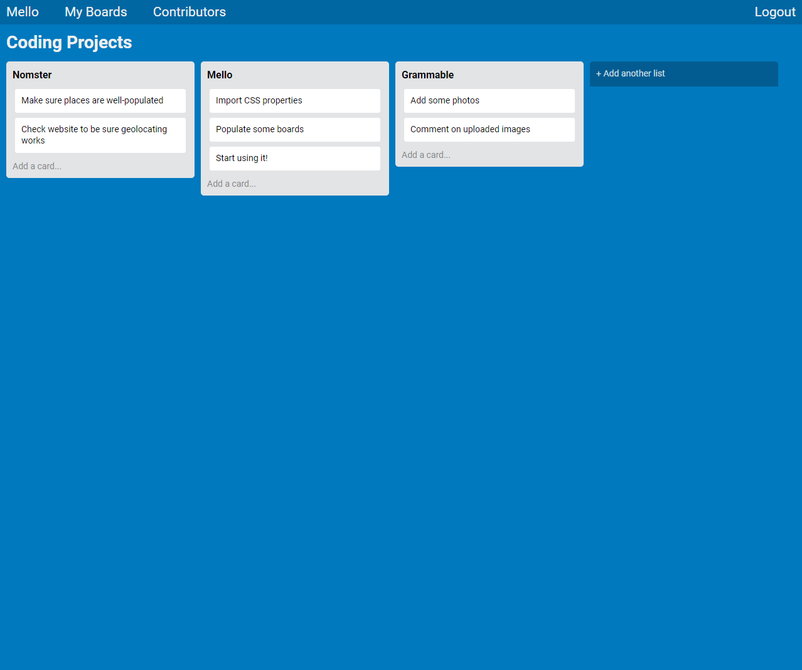

# Mello

Mello is a clone of Trello written with JavaScript, utilizing a pre-built back end. It allows users to log in and generate task management boards, which can be organized by the user.
  
  
[View the deployed application](https://mello-kevin-northrup.herokuapp.com/)
___

### Features:
- Built using Ruby on Rails
- jQuery for constant view updates as changes are made
- Modals for all user-facing forms
- User authentication using JSON Web Tokens (JWT)
- Drag and drop functionality for ease of use
- Multiple contributors can be applied to one board

___
### Screenshot:

